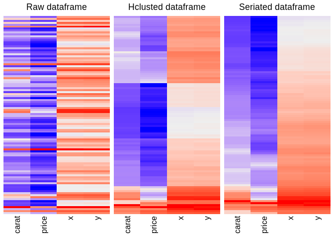

<!-- README.md is generated from README.Rmd. Please edit that file -->

# baizer 

<!-- badges: start -->

[](https://app.codecov.io/gh/william-swl/baizer?branch=master)
[](https://github.com/william-swl/baizer/actions/workflows/check-standard.yaml)
[](https://cran.r-project.org/package=baizer)
[](https://github.com/william-swl/baizer)
[](https://cran.r-project.org/package=baizer)
[](https://cran.r-project.org/package=baizer)
<!-- badges: end -->

- In ancient Chinese mythology, Bai Ze is a divine creature that knows
  the needs of everything.
- `baizer` provides data processing functions frequently used by the
  author.
- Hope this package also knows what you want!

## installation

You can install the stable version of `baizer` like so:

``` r
install.packages("baizer")
```

Or install the development version of `baizer` like so:

``` r
devtools::install_github("william-swl/baizer")
```

## basic utils

- load packages as a batch

``` r
pkglib(dplyr, purrr)
#> 
#> Attaching package: 'dplyr'
#> The following objects are masked from 'package:stats':
#> 
#>     filter, lag
#> The following objects are masked from 'package:base':
#> 
#>     intersect, setdiff, setequal, union
```

- versions of packages

``` r
pkgver(dplyr, purrr)
#> $dplyr
#> [1] "1.1.1"
#> 
#> $purrr
#> [1] "1.0.1"

# case-insensitive input
pkgver(DplyR)
#> $dplyr
#> [1] "1.1.1"
```

- information of packages

``` r
# pkginfo(dplyr)

# case-insensitive input
# pkginfo(DplyR)
```

- use `%nin%` to get ‘not in’ logical value

``` r
1 %nin% c(1, 2, 3)
#> [1] FALSE

1 %nin% c(2, 3)
#> [1] TRUE
```

- use `%neq%` to get `NA` supported ‘not equal’ logical value

``` r
NA != 0
#> [1] NA

NA != NA
#> [1] NA

NA %neq% 0
#> [1] TRUE

NA %neq% NA
#> [1] FALSE
```

- not NA/NULL

``` r
not.na(NA)
#> [1] FALSE

not.null(NULL)
#> [1] FALSE
```

- dump a vector into string

``` r
collapse_vector(c("A" = 2, "B" = 3, "C" = 4), front_name = TRUE, collapse = ";")
#> [1] "A(2);B(3);C(4)"

collapse_vector(c("A" = 2, "B" = 3, "C" = 4), front_name = FALSE, collapse = ",")
#> [1] "2(A),3(B),4(C)"
```

- slice character vector

``` r
x <- c("A", "B", "C", "D", "E")
slice_char(x, "A", "D")
#> [1] "A" "B" "C" "D"
slice_char(x, "D", "A")
#> [1] "D" "C" "B" "A"

x <- c("A", "B", "C", "C", "A", "D", "D", "E", "A")
slice_char(x, "B", "E")
#> [1] "B" "C" "C" "A" "D" "D" "E"
# duplicated element as boundary will throw an error
# slice_char(x, 'A', 'E')
# unique=TRUE to remove the duplicated boundary characters
slice_char(x, "A", "E", unique = TRUE)
#> [1] "A" "B" "C" "C" "D" "D" "E"
```

- the index of different character

``` r
diff_index("AAAA", "ABBA")
#> [[1]]
#> [1] 2 3

# ignore case
diff_index("AAAA", "abba", ignore_case = TRUE)
#> [[1]]
#> [1] 2 3

# only the index of nth different character, NA if unaccessible
diff_index("AAAA", "ABBA", nth = 2)
#> [[1]]
#> [1] 3

diff_index("AAAA", "ABBA", 10)
#> [[1]]
#> [1] NA

# second and third indices
diff_index("AAAA", "ABBB", nth = 2:3)
#> [[1]]
#> [1] 3 4

# support vectorized operations
diff_index(c("ABBA", "AABB"), "AAAA")
#> [[1]]
#> [1] 2 3
#> 
#> [[2]]
#> [1] 3 4
```

- the index of same character

``` r
# just like diff_index
same_index(c("ABBA", "AABB"), "AAAA")
#> [[1]]
#> [1] 1 4
#> 
#> [[2]]
#> [1] 1 2
```

- fetch character from strings

``` r
fetch_char(rep("ABC", 3), list(1, 2, 3))
#> [[1]]
#> [1] "A"
#> 
#> [[2]]
#> [1] "B"
#> 
#> [[3]]
#> [1] "C"

# accept the output of `diff_index` or `same_index`
str1 <- c("ABCD", "AAEF")
str2 <- c("AAAA", "AAAA")
fetch_char(str1, diff_index(str1, str2))
#> [[1]]
#> [1] "B" "C" "D"
#> 
#> [[2]]
#> [1] "E" "F"

# if the output of `diff_index` have NA, also return NA
fetch_char(str1, diff_index(str1, str2, nth = 1:3), na.rm = FALSE)
#> [[1]]
#> [1] "B" "C" "D"
#> 
#> [[2]]
#> [1] "E" "F" NA

# remove NA
fetch_char(str1, diff_index(str1, str2, nth = 1:5), na.rm = TRUE)
#> [[1]]
#> [1] "B" "C" "D"
#> 
#> [[2]]
#> [1] "E" "F"

# collapse the characters from a same string
fetch_char(str1, diff_index(str1, str2, nth = 1:5), na.rm = TRUE, collapse = ",")
#> [[1]]
#> [1] "B,C,D"
#> 
#> [[2]]
#> [1] "E,F"
```

- trans fixed string into regular expression string

``` r
fix_to_regex("ABC|?(*)")
#> [1] "ABC\\|\\?\\(\\*\\)"
```

- detect possible duplication in a vector, ignore case, blank and
  special character

``` r
detect_dup(c("a", "B", "C_", "c -", "#A"))
#> [1] "a"   "#A"  "C_"  "c -"
```

- extract key and values for a character vector

``` r
extract_kv(c("x: 1", "y: 2"))
#>   x   y 
#> "1" "2"
```

- farthest point sampling (FPS) for a vector

``` r
fps_vector(1:10, 2)
#> [1]  1 10

fps_vector(1:10, 4)
#> [1]  1  4  7 10

fps_vector(c(1, 2, NULL), 2)
#> [1] 1 2

fps_vector(c(1, 2, NA), 2)
#> [1]  1 NA
```

- regex match

``` r
v <- stringr::str_c("id", 1:3, c("A", "B", "C"))
v
#> [1] "id1A" "id2B" "id3C"

# return first group as default
reg_match(v, "id(\\d+)(\\w)")
#> [1] "1" "2" "3"

reg_match(v, "id(\\d+)(\\w)", group = 2)
#> [1] "A" "B" "C"

# when group=-1, return full matched tibble
reg_match(v, "id(\\d+)(\\w)", group = -1)
#> # A tibble: 3 × 3
#>   match group1 group2
#>   <chr> <chr>  <chr> 
#> 1 id1A  1      A     
#> 2 id2B  2      B     
#> 3 id3C  3      C
```

- join the matched parts into string

``` r
reg_join(c("A_12.B", "C_3.23:2"), "[A-Za-z]+")
#> [1] "AB" "C"

reg_join(c("A_12.B", "C_3.23:2"), "\\w+")
#> [1] "A_12B"  "C_3232"

reg_join(c("A_12.B", "C_3.23:2"), "\\d+", sep = ",")
#> [1] "12"     "3,23,2"

reg_join(c("A_12.B", "C_3.23:2"), "\\d", sep = ",")
#> [1] "1,2"     "3,2,3,2"
```

- split vector into list

``` r
split_vector(1:10, c(3, 7))
#> [[1]]
#> [1] 1 2 3
#> 
#> [[2]]
#> [1] 4 5 6 7
#> 
#> [[3]]
#> [1]  8  9 10


vec <- stringr::str_split("ABCDEFGHIJ", "") %>% unlist()
vec
#>  [1] "A" "B" "C" "D" "E" "F" "G" "H" "I" "J"

split_vector(vec, breaks = c(3, 7), bounds = "[)")
#> [[1]]
#> [1] "A" "B"
#> 
#> [[2]]
#> [1] "C" "D" "E" "F"
#> 
#> [[3]]
#> [1] "G" "H" "I" "J"
```

- group character vector by a regex pattern

``` r
v <- c(
  stringr::str_c("A", c(1, 2, 9, 10, 11, 12, 99, 101, 102)),
  stringr::str_c("B", c(1, 2, 9, 10, 21, 32, 99, 101, 102))
) %>% sample()
v
#>  [1] "A101" "A12"  "A10"  "A1"   "B32"  "B102" "B101" "B1"   "A102" "B21" 
#> [11] "A99"  "B2"   "B9"   "A2"   "B10"  "A11"  "A9"   "B99"

group_vector(v)
#> $A
#> [1] "A101" "A12"  "A10"  "A1"   "A102" "A99"  "A2"   "A11"  "A9"  
#> 
#> $B
#> [1] "B32"  "B102" "B101" "B1"   "B21"  "B2"   "B9"   "B10"  "B99"

group_vector(v, pattern = "\\w\\d")
#> $A1
#> [1] "A101" "A12"  "A10"  "A1"   "A102" "A11" 
#> 
#> $A2
#> [1] "A2"
#> 
#> $A9
#> [1] "A99" "A9" 
#> 
#> $B1
#> [1] "B102" "B101" "B1"   "B10" 
#> 
#> $B2
#> [1] "B21" "B2" 
#> 
#> $B3
#> [1] "B32"
#> 
#> $B9
#> [1] "B9"  "B99"

# the pattern rules are just same as reg_match()
group_vector(v, pattern = "\\w(\\d)")
#> $`1`
#>  [1] "A101" "A12"  "A10"  "A1"   "B102" "B101" "B1"   "A102" "B10"  "A11" 
#> 
#> $`2`
#> [1] "B21" "B2"  "A2" 
#> 
#> $`3`
#> [1] "B32"
#> 
#> $`9`
#> [1] "A99" "B9"  "A9"  "B99"

# unmatched part will alse be stored
group_vector(v, pattern = "\\d{2}")
#> $`10`
#> [1] "A101" "A10"  "B102" "B101" "A102" "B10" 
#> 
#> $`11`
#> [1] "A11"
#> 
#> $`12`
#> [1] "A12"
#> 
#> $`21`
#> [1] "B21"
#> 
#> $`32`
#> [1] "B32"
#> 
#> $`99`
#> [1] "A99" "B99"
#> 
#> $unmatch
#> [1] "A1" "B1" "B2" "B9" "A2" "A9"
```

- sort by a function

``` r
sortf(c(-2, 1, 3), abs)
#> [1]  1 -2  3

v <- stringr::str_c("id", c(1, 2, 9, 10, 11, 12, 99, 101, 102)) %>% sample()
v
#> [1] "id102" "id11"  "id99"  "id12"  "id9"   "id10"  "id101" "id1"   "id2"

sortf(v, function(x) reg_match(x, "\\d+") %>% as.double())
#> [1] "id1"   "id2"   "id9"   "id10"  "id11"  "id12"  "id99"  "id101" "id102"

# you can also use purrr functions
sortf(v, ~ reg_match(.x, "\\d+") %>% as.double())
#> [1] "id1"   "id2"   "id9"   "id10"  "id11"  "id12"  "id99"  "id101" "id102"


# group before sort
v <- c(
  stringr::str_c("A", c(1, 2, 9, 10, 11, 12, 99, 101, 102)),
  stringr::str_c("B", c(1, 2, 9, 10, 21, 32, 99, 101, 102))
) %>% sample()
v
#>  [1] "A11"  "B101" "B32"  "A9"   "B10"  "B9"   "A12"  "A10"  "A101" "A2"  
#> [11] "B21"  "A1"   "A102" "B1"   "B2"   "A99"  "B99"  "B102"

sortf(v, ~ reg_match(.x, "\\d+") %>% as.double(), group_pattern = "\\w")
#>  [1] "A1"   "A2"   "A9"   "A10"  "A11"  "A12"  "A99"  "A101" "A102" "B1"  
#> [11] "B2"   "B9"   "B10"  "B21"  "B32"  "B99"  "B101" "B102"
```

- pileup another logical vector on the TRUE values of first vector

``` r
# first vector have 2 TRUE value
v1 <- c(TRUE, FALSE, TRUE)

# the length of second vector should also be 2
v2 <- c(FALSE, TRUE)

pileup_logical(v1, v2)
#> [1] FALSE FALSE  TRUE
```

- only keep unique vector values and its names

``` r
v <- c(a = 1, b = 2, c = 3, b = 2, a = 1)

# unique will lost the names
unique(v)
#> [1] 1 2 3

# uniq can keep them
uniq(v)
#> a b c 
#> 1 2 3
```

- replace the items of a list by another

``` r
x <- list(A = 1, B = 3)
y <- list(A = 9, C = 10)

replace_item(x, y)
#> $A
#> [1] 9
#> 
#> $B
#> [1] 3

replace_item(x, y, keep_extra = TRUE)
#> $A
#> [1] 9
#> 
#> $B
#> [1] 3
#> 
#> $C
#> [1] 10


x <- c(A = 1, B = 3)
y <- c(A = 9, C = 10)

replace_item(x, y)
#> A B 
#> 9 3
```

- generate characters

``` r
gen_char(from = "g", n = 5)
#> [1] "g" "h" "i" "j" "k"

gen_char(to = "g", n = 5)
#> [1] "c" "d" "e" "f" "g"

gen_char(from = "g", to = "j")
#> [1] "g" "h" "i" "j"

gen_char(from = "t", n = 5, random = TRUE)
#> [1] "v" "x" "y" "u" "z"

gen_char(from = "x", n = 5, random = TRUE, allow_dup = FALSE, add = c("+", "-"))
#> [1] "y" "x" "z" "-" "+"
```

- trans range character into seq characters

``` r
rng2seq(c("1-5", "2"))
#> [[1]]
#> [1] "1" "2" "3" "4" "5"
#> 
#> [[2]]
#> [1] "2"
```

- return top n items with highest frequency

``` r
top_item(c("a", "b", "c", "b"))
#> [1] "b"

top_item(c(1, 2, 3, 2, 2))
#> [1] 2
```

- melt a vector into single value

``` r
melt_vector(c(NA, 2, 3), method = "first")
#> [1] 2

melt_vector(c(NA, 2, 3), method = "sum")
#> [1] 5

melt_vector(c(NA, 2, 3), method = ",")
#> [1] "2,3"

melt_vector(c(NA, 2, Inf), invalid = c(NA, Inf))
#> [1] 2
```

- combine multiple vectors into one

``` r
x1 <- c(1, 2, NA, NA)
x2 <- c(3, NA, 2, NA)
x3 <- c(4, NA, NA, 3)

combn_vector(x1, x2, x3, method = "sum")
#> [1] 8 2 2 3
```

## numbers

- from float number to fixed digits character

``` r
round(2.1951, 2)
#> [1] 2.2

round_string(2.1951, 2)
#> [1] "2.20"

signif(2.1951, 3)
#> [1] 2.2

signif_string(2.1951, 3)
#> [1] "2.20"
```

- signif or round string depend on the character length

``` r
signif_round_string(20.526, 2, "short")
#> [1] "21"
signif_round_string(20.526, 2, "long")
#> [1] "20.53"

# if you want keep the very small value
signif_round_string(0.000002654, 3, full_small = TRUE)
#> [1] "0.00000265"
```

- signif while use floor/ceiling

``` r
signif_floor(3.19, 2)
#> [1] 3.1

signif_ceiling(3.11, 2)
#> [1] 3.2
```

- whether the number string only has zero

``` r
is.zero("0.000")
#> [1] TRUE

is.zero("0.0001")
#> [1] FALSE
```

- float and percent trans

``` r
float_to_percent(0.123, digits = 1)
#> [1] "12.3%"

percent_to_float("123%", digits = 3)
#> [1] "1.230"

percent_to_float("123%", digits = 3, to_double = TRUE)
#> [1] 1.23
```

- wrapper of the functions to process number string with prefix and
  suffix

``` r
number_fun_wrapper(">=2.134%", function(x) round(x, 2))
#> [1] ">=2.13%"
```

- expand a number vector according to the adjacent two numbers

``` r
adjacent_div(10^c(1:3), n_div = 10)
#>  [1]   10   20   30   40   50   60   70   80   90  100  100  200  300  400  500
#> [16]  600  700  800  900 1000

# only keep the unique numbers
adjacent_div(10^c(1:3), n_div = 10, .unique = TRUE)
#>  [1]   10   20   30   40   50   60   70   80   90  100  200  300  400  500  600
#> [16]  700  800  900 1000
```

- correct the numbers to a target ratio

``` r
correct_ratio(c(10, 10), c(3, 5))
#> [1]  6 10

# support ratio as a float
correct_ratio(c(100, 100), c(0.2, 0.8))
#> [1]  25 100

# more numbers
correct_ratio(10:13, c(2, 3, 4, 6))
#> [1]  4  6  9 13

# with digits after decimal point
correct_ratio(c(10, 10), c(1, 4), digits = 1)
#> [1]  2.5 10.0
```

- the ticks near a number

``` r
near_ticks(3462, level = 10)
#> [1] 3460 3465 3470
```

- the nearest ticks around a number

``` r
nearest_tick(3462, level = 10)
#> [1] 3460
```

- generate ticks for a number vector

``` r
generate_ticks(c(176, 198, 264))
#>  [1] 175 185 195 205 215 225 235 245 255 265
```

- split a positive integer number as a number vector

``` r
pos_int_split(12, 3, method = "average")
#> [1] 4 4 4

pos_int_split(12, 3, method = "random")
#> [1] 5 6 1

# you can also assign the ratio of output
pos_int_split(12, 3, method = c(1, 2, 3))
#> [1] 2 4 6
```

- generate outliers from a series of number

``` r
x <- seq(0, 100, 1)

gen_outlier(x, 10)
#>  [1] -146 -157 -150 -167 -178  257  277  270  300  287

# generation limits
gen_outlier(x, 10, lim = c(-80, 160))
#>  [1] -69 -71 -65 -76 -78 155 157 159 155 157

# assign the low and high outliers
gen_outlier(x, 10, lim = c(-80, 160), assign_n = c(0.1, 0.9))
#>  [1] -53 159 159 156 160 158 155 151 154 159

# just generate low outliers
gen_outlier(x, 10, side = "low")
#>  [1] -167 -176  -68 -113  -81  -89  -52 -152 -185 -198

# return with raw vector
gen_outlier(x, 10, only_out = FALSE)
#>   [1] -128  -76 -171 -152 -191  290  184  270  298  268    0    1    2    3    4
#>  [16]    5    6    7    8    9   10   11   12   13   14   15   16   17   18   19
#>  [31]   20   21   22   23   24   25   26   27   28   29   30   31   32   33   34
#>  [46]   35   36   37   38   39   40   41   42   43   44   45   46   47   48   49
#>  [61]   50   51   52   53   54   55   56   57   58   59   60   61   62   63   64
#>  [76]   65   66   67   68   69   70   71   72   73   74   75   76   77   78   79
#>  [91]   80   81   82   83   84   85   86   87   88   89   90   91   92   93   94
#> [106]   95   96   97   98   99  100
```

- max-min normalization

``` r
mm_norm(c(1, 3, 4))
#> [1] 0.0000000 0.6666667 1.0000000
```

## dataframe

- a minimal dataset

``` r
head(mini_diamond)
#> # A tibble: 6 × 7
#>   id    carat cut   clarity price     x     y
#>   <chr> <dbl> <chr> <chr>   <int> <dbl> <dbl>
#> 1 id-1   1.02 Fair  SI1      3027  6.25  6.18
#> 2 id-2   1.51 Good  VS2     11746  7.27  7.18
#> 3 id-3   0.52 Ideal VVS1     2029  5.15  5.18
#> 4 id-4   1.54 Ideal SI2      9452  7.43  7.45
#> 5 id-5   0.72 Ideal VS1      2498  5.73  5.77
#> 6 id-6   2.02 Fair  SI2     14080  8.33  8.37
```

- shortcut of `dplyr::column_to_rownames` and
  `dplyr::rownames_to_column`

``` r
head(mini_diamond) %>% c2r("id")
#>      carat   cut clarity price    x    y
#> id-1  1.02  Fair     SI1  3027 6.25 6.18
#> id-2  1.51  Good     VS2 11746 7.27 7.18
#> id-3  0.52 Ideal    VVS1  2029 5.15 5.18
#> id-4  1.54 Ideal     SI2  9452 7.43 7.45
#> id-5  0.72 Ideal     VS1  2498 5.73 5.77
#> id-6  2.02  Fair     SI2 14080 8.33 8.37

# use column index
head(mini_diamond) %>% c2r(1)
#>      carat   cut clarity price    x    y
#> id-1  1.02  Fair     SI1  3027 6.25 6.18
#> id-2  1.51  Good     VS2 11746 7.27 7.18
#> id-3  0.52 Ideal    VVS1  2029 5.15 5.18
#> id-4  1.54 Ideal     SI2  9452 7.43 7.45
#> id-5  0.72 Ideal     VS1  2498 5.73 5.77
#> id-6  2.02  Fair     SI2 14080 8.33 8.37

head(mini_diamond) %>%
  c2r("id") %>%
  r2c("id")
#> # A tibble: 6 × 7
#>   id    carat cut   clarity price     x     y
#>   <chr> <dbl> <chr> <chr>   <int> <dbl> <dbl>
#> 1 id-1   1.02 Fair  SI1      3027  6.25  6.18
#> 2 id-2   1.51 Good  VS2     11746  7.27  7.18
#> 3 id-3   0.52 Ideal VVS1     2029  5.15  5.18
#> 4 id-4   1.54 Ideal SI2      9452  7.43  7.45
#> 5 id-5   0.72 Ideal VS1      2498  5.73  5.77
#> 6 id-6   2.02 Fair  SI2     14080  8.33  8.37
```

- fancy count to show an extended column

``` r

# count one column
fancy_count(mini_diamond, cut)
#> # A tibble: 3 × 3
#>   cut       n     r
#>   <chr> <int> <dbl>
#> 1 Fair     35  0.35
#> 2 Good     31  0.31
#> 3 Ideal    34  0.34

# count an extended column
fancy_count(mini_diamond, cut, ext = clarity)
#> # A tibble: 3 × 4
#>   cut       n     r clarity                                                
#>   <chr> <int> <dbl> <chr>                                                  
#> 1 Fair     35  0.35 I1(5),IF(4),SI1(5),SI2(4),VS1(3),VS2(5),VVS1(5),VVS2(4)
#> 2 Good     31  0.31 I1(5),IF(5),SI1(4),SI2(4),VS1(2),VS2(4),VVS1(4),VVS2(3)
#> 3 Ideal    34  0.34 I1(4),IF(4),SI1(5),SI2(4),VS1(5),VS2(2),VVS1(5),VVS2(5)

# change format
fancy_count(mini_diamond, cut, ext = clarity, ext_fmt = "ratio")
#> # A tibble: 3 × 4
#>   cut       n     r clarity                                                     
#>   <chr> <int> <dbl> <chr>                                                       
#> 1 Fair     35  0.35 I1(0.14),IF(0.11),SI1(0.14),SI2(0.11),VS1(0.09),VS2(0.14),V…
#> 2 Good     31  0.31 I1(0.16),IF(0.16),SI1(0.13),SI2(0.13),VS1(0.06),VS2(0.13),V…
#> 3 Ideal    34  0.34 I1(0.12),IF(0.12),SI1(0.15),SI2(0.12),VS1(0.15),VS2(0.06),V…

fancy_count(mini_diamond, cut, ext = clarity, ext_fmt = "clean")
#> # A tibble: 3 × 4
#>   cut       n     r clarity                        
#>   <chr> <int> <dbl> <chr>                          
#> 1 Fair     35  0.35 I1,IF,SI1,SI2,VS1,VS2,VVS1,VVS2
#> 2 Good     31  0.31 I1,IF,SI1,SI2,VS1,VS2,VVS1,VVS2
#> 3 Ideal    34  0.34 I1,IF,SI1,SI2,VS1,VS2,VVS1,VVS2

# count an extended column, in an order by n
fancy_count(mini_diamond, cut, ext = clarity, sort = TRUE)
#> # A tibble: 3 × 4
#>   cut       n     r clarity                                                
#>   <chr> <int> <dbl> <chr>                                                  
#> 1 Fair     35  0.35 I1(5),SI1(5),VS2(5),VVS1(5),IF(4),SI2(4),VVS2(4),VS1(3)
#> 2 Ideal    34  0.34 SI1(5),VS1(5),VVS1(5),VVS2(5),I1(4),IF(4),SI2(4),VS2(2)
#> 3 Good     31  0.31 I1(5),IF(5),SI1(4),SI2(4),VS2(4),VVS1(4),VVS2(3),VS1(2)

# extended column after a two-column count
fancy_count(mini_diamond, cut, clarity, ext = id) %>% head(5)
#> # A tibble: 5 × 5
#>   cut   clarity     n     r id                                          
#>   <chr> <chr>   <int> <dbl> <chr>                                       
#> 1 Fair  I1          5  0.05 id-20(1),id-23(1),id-28(1),id-32(1),id-48(1)
#> 2 Fair  IF          4  0.04 id-12(1),id-45(1),id-89(1),id-95(1)         
#> 3 Fair  SI1         5  0.05 id-1(1),id-64(1),id-65(1),id-68(1),id-76(1) 
#> 4 Fair  SI2         4  0.04 id-25(1),id-40(1),id-6(1),id-99(1)          
#> 5 Fair  VS1         3  0.03 id-36(1),id-43(1),id-85(1)
```

- count two columns as a cross-tabulation table

``` r
cross_count(mini_diamond, cut, clarity)
#>       I1 IF SI1 SI2 VS1 VS2 VVS1 VVS2
#> Fair   5  4   5   4   3   5    5    4
#> Good   5  5   4   4   2   4    4    3
#> Ideal  4  4   5   4   5   2    5    5

# show the ratio in the row
cross_count(mini_diamond, cut, clarity, method = "rowr")
#>         I1   IF  SI1  SI2  VS1  VS2 VVS1 VVS2
#> Fair  0.14 0.11 0.14 0.11 0.09 0.14 0.14 0.11
#> Good  0.16 0.16 0.13 0.13 0.06 0.13 0.13 0.10
#> Ideal 0.12 0.12 0.15 0.12 0.15 0.06 0.15 0.15

# show the ratio in the col
cross_count(mini_diamond, cut, clarity, method = "colr")
#>         I1   IF  SI1  SI2 VS1  VS2 VVS1 VVS2
#> Fair  0.36 0.31 0.36 0.33 0.3 0.45 0.36 0.33
#> Good  0.36 0.38 0.29 0.33 0.2 0.36 0.29 0.25
#> Ideal 0.29 0.31 0.36 0.33 0.5 0.18 0.36 0.42
```

- split a column and return a longer tibble

``` r
df <- fancy_count(mini_diamond, cut, ext = clarity)
head(df)
#> # A tibble: 3 × 4
#>   cut       n     r clarity                                                
#>   <chr> <int> <dbl> <chr>                                                  
#> 1 Fair     35  0.35 I1(5),IF(4),SI1(5),SI2(4),VS1(3),VS2(5),VVS1(5),VVS2(4)
#> 2 Good     31  0.31 I1(5),IF(5),SI1(4),SI2(4),VS1(2),VS2(4),VVS1(4),VVS2(3)
#> 3 Ideal    34  0.34 I1(4),IF(4),SI1(5),SI2(4),VS1(5),VS2(2),VVS1(5),VVS2(5)

split_column(df, name_col = cut, value_col = clarity)
#> # A tibble: 24 × 2
#>    cut   clarity
#>    <chr> <chr>  
#>  1 Fair  I1(5)  
#>  2 Fair  IF(4)  
#>  3 Fair  SI1(5) 
#>  4 Fair  SI2(4) 
#>  5 Fair  VS1(3) 
#>  6 Fair  VS2(5) 
#>  7 Fair  VVS1(5)
#>  8 Fair  VVS2(4)
#>  9 Good  I1(5)  
#> 10 Good  IF(5)  
#> # … with 14 more rows
```

- move selected rows to target location

``` r
# move row 3-5 after row 8
move_row(mini_diamond, 3:5, .after = 8)
#> # A tibble: 100 × 7
#>    id    carat cut   clarity price     x     y
#>    <chr> <dbl> <chr> <chr>   <int> <dbl> <dbl>
#>  1 id-1   1.02 Fair  SI1      3027  6.25  6.18
#>  2 id-2   1.51 Good  VS2     11746  7.27  7.18
#>  3 id-6   2.02 Fair  SI2     14080  8.33  8.37
#>  4 id-7   0.27 Good  VVS1      752  4.1   4.07
#>  5 id-8   0.51 Good  SI2      1029  5.05  5.08
#>  6 id-3   0.52 Ideal VVS1     2029  5.15  5.18
#>  7 id-4   1.54 Ideal SI2      9452  7.43  7.45
#>  8 id-5   0.72 Ideal VS1      2498  5.73  5.77
#>  9 id-9   1.01 Ideal SI1      5590  6.43  6.4 
#> 10 id-10  0.7  Fair  VVS1     1691  5.56  5.41
#> # … with 90 more rows

# move row 3-5 before the first row
move_row(mini_diamond, 3:5, .before = TRUE)
#> # A tibble: 100 × 7
#>    id    carat cut   clarity price     x     y
#>    <chr> <dbl> <chr> <chr>   <int> <dbl> <dbl>
#>  1 id-3   0.52 Ideal VVS1     2029  5.15  5.18
#>  2 id-4   1.54 Ideal SI2      9452  7.43  7.45
#>  3 id-5   0.72 Ideal VS1      2498  5.73  5.77
#>  4 id-1   1.02 Fair  SI1      3027  6.25  6.18
#>  5 id-2   1.51 Good  VS2     11746  7.27  7.18
#>  6 id-6   2.02 Fair  SI2     14080  8.33  8.37
#>  7 id-7   0.27 Good  VVS1      752  4.1   4.07
#>  8 id-8   0.51 Good  SI2      1029  5.05  5.08
#>  9 id-9   1.01 Ideal SI1      5590  6.43  6.4 
#> 10 id-10  0.7  Fair  VVS1     1691  5.56  5.41
#> # … with 90 more rows

# move row 3-5 after the last row
move_row(mini_diamond, 3:5, .after = TRUE)
#> # A tibble: 100 × 7
#>    id    carat cut   clarity price     x     y
#>    <chr> <dbl> <chr> <chr>   <int> <dbl> <dbl>
#>  1 id-1   1.02 Fair  SI1      3027  6.25  6.18
#>  2 id-2   1.51 Good  VS2     11746  7.27  7.18
#>  3 id-6   2.02 Fair  SI2     14080  8.33  8.37
#>  4 id-7   0.27 Good  VVS1      752  4.1   4.07
#>  5 id-8   0.51 Good  SI2      1029  5.05  5.08
#>  6 id-9   1.01 Ideal SI1      5590  6.43  6.4 
#>  7 id-10  0.7  Fair  VVS1     1691  5.56  5.41
#>  8 id-11  1.02 Good  VVS1     7861  6.37  6.4 
#>  9 id-12  0.71 Fair  IF       3205  5.87  5.81
#> 10 id-13  0.56 Ideal SI1      1633  5.31  5.32
#> # … with 90 more rows
```

- slice a tibble by an ordered vector

``` r
ordered_slice(mini_diamond, id, c("id-3", "id-2"))
#> # A tibble: 2 × 7
#>   id    carat cut   clarity price     x     y
#>   <chr> <dbl> <chr> <chr>   <int> <dbl> <dbl>
#> 1 id-3   0.52 Ideal VVS1     2029  5.15  5.18
#> 2 id-2   1.51 Good  VS2     11746  7.27  7.18

# support NA and known values in ordered vector
ordered_slice(mini_diamond, id, c("id-3", "id-2", "unknown_id", "id-3", NA))
#> Warning in ordered_slice(mini_diamond, id, c("id-3", "id-2", "unknown_id", : 2
#> NA values!
#> Warning in ordered_slice(mini_diamond, id, c("id-3", "id-2", "unknown_id", : 2
#> duplicated values!
#> # A tibble: 5 × 7
#>   id    carat cut   clarity price     x     y
#>   <chr> <dbl> <chr> <chr>   <int> <dbl> <dbl>
#> 1 id-3   0.52 Ideal VVS1     2029  5.15  5.18
#> 2 id-2   1.51 Good  VS2     11746  7.27  7.18
#> 3 <NA>  NA    <NA>  <NA>       NA NA    NA   
#> 4 id-3   0.52 Ideal VVS1     2029  5.15  5.18
#> 5 <NA>  NA    <NA>  <NA>       NA NA    NA

# remove NA
ordered_slice(mini_diamond, id, c("id-3", "id-2", "unknown_id", "id-3", NA),
  na.rm = TRUE
)
#> Warning in ordered_slice(mini_diamond, id, c("id-3", "id-2", "unknown_id", : 2
#> NA values!
#> Warning in ordered_slice(mini_diamond, id, c("id-3", "id-2", "unknown_id", : 2
#> duplicated values!
#> # A tibble: 3 × 7
#>   id    carat cut   clarity price     x     y
#>   <chr> <dbl> <chr> <chr>   <int> <dbl> <dbl>
#> 1 id-3   0.52 Ideal VVS1     2029  5.15  5.18
#> 2 id-2   1.51 Good  VS2     11746  7.27  7.18
#> 3 id-3   0.52 Ideal VVS1     2029  5.15  5.18

# remove duplication
ordered_slice(mini_diamond, id, c("id-3", "id-2", "unknown_id", "id-3", NA),
  dup.rm = TRUE
)
#> Warning in ordered_slice(mini_diamond, id, c("id-3", "id-2", "unknown_id", : 2
#> NA values!
#> Warning in ordered_slice(mini_diamond, id, c("id-3", "id-2", "unknown_id", : 2
#> duplicated values!
#> # A tibble: 3 × 7
#>   id    carat cut   clarity price     x     y
#>   <chr> <dbl> <chr> <chr>   <int> <dbl> <dbl>
#> 1 id-3   0.52 Ideal VVS1     2029  5.15  5.18
#> 2 id-2   1.51 Good  VS2     11746  7.27  7.18
#> 3 <NA>  NA    <NA>  <NA>       NA NA    NA
```

- remove columns by the ratio of NA, default to remove the columns only
  have NA

``` r
df_with_nacol <- dplyr::bind_cols(
  mini_diamond,
  tibble::tibble(na1 = NA, na2 = NA)
)
df_with_nacol
#> # A tibble: 100 × 9
#>    id    carat cut   clarity price     x     y na1   na2  
#>    <chr> <dbl> <chr> <chr>   <int> <dbl> <dbl> <lgl> <lgl>
#>  1 id-1   1.02 Fair  SI1      3027  6.25  6.18 NA    NA   
#>  2 id-2   1.51 Good  VS2     11746  7.27  7.18 NA    NA   
#>  3 id-3   0.52 Ideal VVS1     2029  5.15  5.18 NA    NA   
#>  4 id-4   1.54 Ideal SI2      9452  7.43  7.45 NA    NA   
#>  5 id-5   0.72 Ideal VS1      2498  5.73  5.77 NA    NA   
#>  6 id-6   2.02 Fair  SI2     14080  8.33  8.37 NA    NA   
#>  7 id-7   0.27 Good  VVS1      752  4.1   4.07 NA    NA   
#>  8 id-8   0.51 Good  SI2      1029  5.05  5.08 NA    NA   
#>  9 id-9   1.01 Ideal SI1      5590  6.43  6.4  NA    NA   
#> 10 id-10  0.7  Fair  VVS1     1691  5.56  5.41 NA    NA   
#> # … with 90 more rows

remove_nacol(df_with_nacol)
#> # A tibble: 100 × 7
#>    id    carat cut   clarity price     x     y
#>    <chr> <dbl> <chr> <chr>   <int> <dbl> <dbl>
#>  1 id-1   1.02 Fair  SI1      3027  6.25  6.18
#>  2 id-2   1.51 Good  VS2     11746  7.27  7.18
#>  3 id-3   0.52 Ideal VVS1     2029  5.15  5.18
#>  4 id-4   1.54 Ideal SI2      9452  7.43  7.45
#>  5 id-5   0.72 Ideal VS1      2498  5.73  5.77
#>  6 id-6   2.02 Fair  SI2     14080  8.33  8.37
#>  7 id-7   0.27 Good  VVS1      752  4.1   4.07
#>  8 id-8   0.51 Good  SI2      1029  5.05  5.08
#>  9 id-9   1.01 Ideal SI1      5590  6.43  6.4 
#> 10 id-10  0.7  Fair  VVS1     1691  5.56  5.41
#> # … with 90 more rows

# remove the columns that have more than 20% NA values
# remove_nacol(df_with_nacol, max_ratio=0.2)
```

- remove rows by the ratio of NA

``` r
# remove_narow(df)
```

- separate numeric vector into bins

``` r
vector <- dplyr::pull(mini_diamond, price, id)

hist_bins(vector)
#> # A tibble: 100 × 5
#>    id    value  start    end   bin
#>    <chr> <int>  <dbl>  <dbl> <int>
#>  1 id-1   3027  2218.  3975.     2
#>  2 id-2  11746 11000. 12757.     7
#>  3 id-3   2029   462   2218.     1
#>  4 id-4   9452  9244  11000.     6
#>  5 id-5   2498  2218.  3975.     2
#>  6 id-6  14080 12757. 14513.     8
#>  7 id-7    752   462   2218.     1
#>  8 id-8   1029   462   2218.     1
#>  9 id-9   5590  3975.  5731.     3
#> 10 id-10  1691   462   2218.     1
#> # … with 90 more rows

# set the max and min limits
hist_bins(vector, bins = 20, lim = c(0, 20000))
#> # A tibble: 100 × 5
#>    id    value start   end   bin
#>    <chr> <int> <dbl> <dbl> <int>
#>  1 id-1   3027  3000  4000     4
#>  2 id-2  11746 11000 12000    12
#>  3 id-3   2029  2000  3000     3
#>  4 id-4   9452  9000 10000    10
#>  5 id-5   2498  2000  3000     3
#>  6 id-6  14080 14000 15000    15
#>  7 id-7    752     0  1000     1
#>  8 id-8   1029  1000  2000     2
#>  9 id-9   5590  5000  6000     6
#> 10 id-10  1691  1000  2000     2
#> # … with 90 more rows

# or pass breaks directly
hist_bins(vector, breaks = seq(0, 20000, length.out = 11))
#> # A tibble: 100 × 5
#>    id    value start   end   bin
#>    <chr> <int> <dbl> <dbl> <int>
#>  1 id-1   3027  2000  4000     2
#>  2 id-2  11746 10000 12000     6
#>  3 id-3   2029  2000  4000     2
#>  4 id-4   9452  8000 10000     5
#>  5 id-5   2498  2000  4000     2
#>  6 id-6  14080 14000 16000     8
#>  7 id-7    752     0  2000     1
#>  8 id-8   1029     0  2000     1
#>  9 id-9   5590  4000  6000     3
#> 10 id-10  1691     0  2000     1
#> # … with 90 more rows
```

- trans a table in markdown format into tibble

``` r
x <- "
  | col1 | col2 | col3 |
  | ---- | ---- | ---- |
  | v1   | v2   | v3   |
  | r1   | r2   | r3   |
  "

as_tibble_md(x)
#> # A tibble: 2 × 3
#>   col1  col2  col3 
#>   <chr> <chr> <chr>
#> 1 v1    v2    v3   
#> 2 r1    r2    r3
```

- trans a tibble into markdown format table

``` r
mini_diamond %>%
  head(5) %>%
  as_md_table()
#> | id | carat | cut | clarity | price | x | y |
#> | - | - | - | - | - | - | - |
#> | id-1 | 1.02 | Fair | SI1 |  3027 | 6.25 | 6.18 |
#> | id-2 | 1.51 | Good | VS2 | 11746 | 7.27 | 7.18 |
#> | id-3 | 0.52 | Ideal | VVS1 |  2029 | 5.15 | 5.18 |
#> | id-4 | 1.54 | Ideal | SI2 |  9452 | 7.43 | 7.45 |
#> | id-5 | 0.72 | Ideal | VS1 |  2498 | 5.73 | 5.77 |
```

- relevel a target column by another reference column

``` r
cut_level <- mini_diamond %>%
  pull(cut) %>%
  unique()
df <- mini_diamond %>%
  dplyr::mutate(cut = factor(cut, cut_level)) %>%
  dplyr::mutate(cut0 = stringr::str_c(cut, "xxx"))

levels(df$cut)
#> [1] "Fair"  "Good"  "Ideal"

levels(df$cut0)
#> NULL

# after relevel
df <- ref_level(df, cut0, cut)

levels(df$cut)
#> [1] "Fair"  "Good"  "Ideal"

levels(df$cut0)
#> [1] "Fairxxx"  "Goodxxx"  "Idealxxx"
```

- trans list into tibble

``` r
x <- list(
  c("a", "1"),
  c("b", "2"),
  c("c", "3")
)

list2tibble(x, colnames = c("char", "num"))
#> # A tibble: 3 × 2
#>   char  num  
#>   <chr> <chr>
#> 1 a     1    
#> 2 b     2    
#> 3 c     3


x <- list(
  c("a", "b", "c"),
  c("1", "2", "3")
)

list2tibble(x, method = "col")
#> # A tibble: 3 × 2
#>   V1    V2   
#>   <chr> <chr>
#> 1 a     1    
#> 2 b     2    
#> 3 c     3
```

- generate a matrix to show whether the item in each element of a list

``` r
x <- 1:5 %>% map(~ gen_char(to = "k", n = 5, random = TRUE, seed = .x))

x
#> [[1]]
#> [1] "i" "d" "g" "a" "b"
#> 
#> [[2]]
#> [1] "e" "f" "f" "h" "a"
#> 
#> [[3]]
#> [1] "e" "j" "g" "d" "j"
#> 
#> [[4]]
#> [1] "h" "k" "c" "c" "g"
#> 
#> [[5]]
#> [1] "b" "k" "i" "k" "i"

exist_matrix(x)
#> # A tibble: 5 × 11
#>   g     i     k     a     b     c     d     e     f     h     j    
#> * <lgl> <lgl> <lgl> <lgl> <lgl> <lgl> <lgl> <lgl> <lgl> <lgl> <lgl>
#> 1 TRUE  TRUE  FALSE TRUE  TRUE  FALSE TRUE  FALSE FALSE FALSE FALSE
#> 2 FALSE FALSE FALSE TRUE  FALSE FALSE FALSE TRUE  TRUE  TRUE  FALSE
#> 3 TRUE  FALSE FALSE FALSE FALSE FALSE TRUE  TRUE  FALSE FALSE TRUE 
#> 4 TRUE  FALSE TRUE  FALSE FALSE TRUE  FALSE FALSE FALSE TRUE  FALSE
#> 5 FALSE TRUE  TRUE  FALSE TRUE  FALSE FALSE FALSE FALSE FALSE FALSE
```

- dataframe rows seriation, which will reorder the rows in a better
  pattern. Sometimes clearer than `hclust`

``` r
seriated_df <- seriate_df(df)
```



- diagnosis a tibble for character NA, NULL, all T/F column, blank in
  cell

``` r
x <- tibble(
  c1 = c("NA", NA, "a", "b"),
  c2 = c("c", "d", "e", "NULL"),
  c3 = c("T", "F", "F", "T"),
  c4 = c("T", "F", "F", NA),
  c5 = c("", " ", "\t", "\n")
)
x
#> # A tibble: 4 × 5
#>   c1    c2    c3    c4    c5   
#>   <chr> <chr> <chr> <chr> <chr>
#> 1 NA    c     T     T     ""   
#> 2 <NA>  d     F     F     " "  
#> 3 a     e     F     F     "\t" 
#> 4 b     NULL  T     <NA>  "\n"

dx_tb(x)
#> $chr_na
#> # A tibble: 1 × 2
#>     row   col
#>   <int> <int>
#> 1     1     1
#> 
#> $chr_null
#> # A tibble: 1 × 2
#>     row   col
#>   <int> <int>
#> 1     4     2
#> 
#> $only_tf
#> [1] 3 4
#> 
#> $blank_in_cell
#> [1] " "  "\t" "\n"
#> 
#> $stat
#>        chr_na      chr_null       only_tf blank_in_cell 
#>             1             1             2             3 
#> 
#> $pass
#> [1] FALSE
```

- generate tibbles

``` r
gen_tb()
#> # A tibble: 3 × 4
#>       V1     V2    V3     V4
#>    <dbl>  <dbl> <dbl>  <dbl>
#> 1 -0.218 -1.07   1.27  1.04 
#> 2 -0.278  0.493 -1.64 -1.78 
#> 3  0.353  0.541  1.96  0.258

gen_tb(fill = "str", nrow = 3, ncol = 4, len = 3)
#> # A tibble: 3 × 4
#>   V1    V2    V3    V4   
#>   <chr> <chr> <chr> <chr>
#> 1 iph   qsx   ewy   jak  
#> 2 vrz   qmq   uei   cig  
#> 3 pcx   lmm   yzq   pig
```

- differences between two tibbles

``` r
tb1 <- gen_tb(fill = "int", seed = 1)
tb1
#> # A tibble: 3 × 4
#>      V1    V2    V3    V4
#>   <dbl> <dbl> <dbl> <dbl>
#> 1    -7    15     4    -4
#> 2     1     3     7    15
#> 3    -9    -9     5     3

tb2 <- gen_tb(fill = "int", seed = 3)
tb2
#> # A tibble: 3 × 4
#>      V1    V2    V3    V4
#>   <dbl> <dbl> <dbl> <dbl>
#> 1   -10   -12     0    12
#> 2    -3     1    11    -8
#> 3     2     0   -13   -12

diff_tb(tb1, tb2)
#> # A tibble: 6 × 5
#>   compare V1    V2    V3    V4   
#>   <chr>   <chr> <chr> <chr> <chr>
#> 1 -[1,]   -7    15    4     -4   
#> 2 +[1,]   -10   -12   0     12   
#> 3 -[2,]   1     3     7     15   
#> 4 +[2,]   -3    1     11    -8   
#> 5 -[3,]   -9    -9    5     3    
#> 6 +[3,]   2     0     -13   -12
```

- transpose a dataframe

``` r
tdf(c2r(head(mini_diamond), "id"))
#> # A tibble: 6 × 7
#>   item    `id-1`  `id-2` `id-3`  `id-4`  `id-5`  `id-6`
#>   <chr>   <chr>   <chr>  <chr>   <chr>   <chr>   <chr> 
#> 1 carat   "1.02"  1.51   "0.52"  "1.54"  "0.72"  2.02  
#> 2 cut     "Fair"  Good   "Ideal" "Ideal" "Ideal" Fair  
#> 3 clarity "SI1"   VS2    "VVS1"  "SI2"   "VS1"   SI2   
#> 4 price   " 3027" 11746  " 2029" " 9452" " 2498" 14080 
#> 5 x       "6.25"  7.27   "5.15"  "7.43"  "5.73"  8.33  
#> 6 y       "6.18"  7.18   "5.18"  "7.45"  "5.77"  8.37
```

- count unique values in each column

``` r
uniq_in_cols(mini_diamond)
#> # A tibble: 7 × 2
#>   col     uniqe_values
#>   <chr>   <chr>       
#> 1 id      100         
#> 2 carat   57          
#> 3 cut     3           
#> 4 clarity 8           
#> 5 price   99          
#> 6 x       89          
#> 7 y       87
```

## stat

- generate all combinations

``` r
gen_combn(1:4, n = 2)
#> [[1]]
#> [1] 1 2
#> 
#> [[2]]
#> [1] 1 3
#> 
#> [[3]]
#> [1] 1 4
#> 
#> [[4]]
#> [1] 2 3
#> 
#> [[5]]
#> [1] 2 4
#> 
#> [[6]]
#> [1] 3 4
```

- statistical test which returns a extensible tibble

``` r
stat_test(mini_diamond, y = price, x = cut, .by = clarity)
#> # A tibble: 24 × 9
#>    y     clarity group1 group2    n1    n2      p  plim symbol
#>    <chr> <chr>   <chr>  <chr>  <int> <int>  <dbl> <dbl> <chr> 
#>  1 price I1      Fair   Good       5     5 0.310   1.01 NS    
#>  2 price I1      Fair   Ideal      5     4 0.905   1.01 NS    
#>  3 price I1      Good   Ideal      5     4 0.190   1.01 NS    
#>  4 price IF      Fair   Good       4     5 0.0635  1.01 NS    
#>  5 price IF      Fair   Ideal      4     4 0.0591  1.01 NS    
#>  6 price IF      Good   Ideal      5     4 1       1.01 NS    
#>  7 price SI1     Fair   Good       5     4 1       1.01 NS    
#>  8 price SI1     Fair   Ideal      5     5 1       1.01 NS    
#>  9 price SI1     Good   Ideal      4     5 0.413   1.01 NS    
#> 10 price SI2     Fair   Good       4     4 0.0571  1.01 NS    
#> # … with 14 more rows
```

- fold change calculation which returns a extensible tibble

``` r
stat_fc(mini_diamond, y = price, x = cut, .by = clarity)
#> # A tibble: 24 × 8
#>    y     clarity group1 group2     y1    y2    fc fc_fmt
#>    <chr> <chr>   <chr>  <chr>   <dbl> <dbl> <dbl> <chr> 
#>  1 price I1      Fair   Good    4695. 2760. 1.70  1.7x  
#>  2 price I1      Fair   Ideal   4695. 4249  1.11  1.1x  
#>  3 price I1      Good   Ideal   2760. 4249  0.649 0.65x 
#>  4 price IF      Fair   Good    2016  1044. 1.93  1.9x  
#>  5 price IF      Fair   Ideal   2016   962. 2.10  2.1x  
#>  6 price IF      Good   Ideal   1044.  962. 1.09  1.1x  
#>  7 price SI1     Fair   Good    5844. 3227. 1.81  1.8x  
#>  8 price SI1     Fair   Ideal   5844. 3877. 1.51  1.5x  
#>  9 price SI1     Good   Ideal   3227. 3877. 0.832 0.83x 
#> 10 price SI2     Fair   Good   13162. 6539. 2.01  2.0x  
#> # … with 14 more rows
```

- calculate phi coefficient of two binary variables

``` r
data <- matrix(c(10, 8, 14, 18), nrow = 2)
stat_phi(data)
#> [1] 0.1134241
```

## IO

- get the command line arguments

``` r
cmdargs()
#> $wd
#> [1] "/home/william/rpkg/baizer"
#> 
#> $R_env
#> [1] "/home/william/software/mambaforge/envs/baizer/lib/R/bin/exec/R"
#> 
#> $script_path
#> character(0)
#> 
#> $script_dir
#> character(0)
#> 
#> $env_configs
#> [1] "--slave"                              
#> [2] "--no-save"                            
#> [3] "--no-restore"                         
#> [4] "-f"                                   
#> [5] "/tmp/RtmpI0to3Z/callr-scr-51aa573469f"

cmdargs("R_env")
#> [1] "/home/william/software/mambaforge/envs/baizer/lib/R/bin/exec/R"
```

- detect whether directory is empty recursively, and detect whether file
  is empty recursively

``` r
# create an empty directory
dir.create("some/deep/path/in/a/folder", recursive = TRUE)
empty_dir("some/deep/path/in/a/folder")
#> [1] TRUE

# create an empty file
file.create("some/deep/path/in/a/folder/there_is_a_file.txt")
#> [1] TRUE
empty_dir("some/deep/path/in/a/folder")
#> [1] FALSE
empty_file("some/deep/path/in/a/folder/there_is_a_file.txt", strict = TRUE)
#> [1] TRUE

# create a file with only character of length 0
write("", "some/deep/path/in/a/folder/there_is_a_file.txt")
empty_file("some/deep/path/in/a/folder/there_is_a_file.txt", strict = TRUE)
#> [1] FALSE
empty_file("some/deep/path/in/a/folder/there_is_a_file.txt")
#> [1] TRUE

# clean
unlink("some", recursive = TRUE)
```

- write a tibble, or a list of tibbles into an excel file

``` r
# write_excel(mini_diamond, "mini_diamond.xlsx")

# Ldf <- list(mini_diamond[1:3, ], mini_diamond[4:6, ])
# write_excel(Ldf, '2sheets.xlsx')
```

- fetch remote files via sftp

``` r
# sftp_con <- sftp_connect(server='remote_host', port=22,
#                         user='username', password = "password", wd='~')
#
# sftp_download(sftp_con,
#    path=c('t1.txt', 't2.txt'),
#    to=c('path1.txt', 'path2.txt')
# )
```

- list files from remote server via sftp

``` r
# sftp_ls(sftp_con, 'your/dir')
```

## S3 classes in `baizer`

### tbflt

- save a series of filter conditions, and support logical operation
  among conditions
- use `filterC` to apply `tbflt` on `dplyr::filter`

``` r
c1 <- tbflt(cut == "Fair")
c2 <- tbflt(x > 8)
c1 | c2
#> <quosure>
#> expr: ^cut == "Fair" | x > 8
#> env:  0x55f7a8a8b0e8

mini_diamond %>%
  filterC(c1) %>%
  head(5)
#> # A tibble: 5 × 7
#>   id    carat cut   clarity price     x     y
#>   <chr> <dbl> <chr> <chr>   <int> <dbl> <dbl>
#> 1 id-1   1.02 Fair  SI1      3027  6.25  6.18
#> 2 id-6   2.02 Fair  SI2     14080  8.33  8.37
#> 3 id-10  0.7  Fair  VVS1     1691  5.56  5.41
#> 4 id-12  0.71 Fair  IF       3205  5.87  5.81
#> 5 id-18  0.34 Fair  VVS1     1012  4.8   4.76

mini_diamond %>%
  filterC(!c1) %>%
  head(5)
#> # A tibble: 5 × 7
#>   id    carat cut   clarity price     x     y
#>   <chr> <dbl> <chr> <chr>   <int> <dbl> <dbl>
#> 1 id-2   1.51 Good  VS2     11746  7.27  7.18
#> 2 id-3   0.52 Ideal VVS1     2029  5.15  5.18
#> 3 id-4   1.54 Ideal SI2      9452  7.43  7.45
#> 4 id-5   0.72 Ideal VS1      2498  5.73  5.77
#> 5 id-7   0.27 Good  VVS1      752  4.1   4.07

mini_diamond %>% filterC(c1 & c2)
#> # A tibble: 3 × 7
#>   id    carat cut   clarity price     x     y
#>   <chr> <dbl> <chr> <chr>   <int> <dbl> <dbl>
#> 1 id-6   2.02 Fair  SI2     14080  8.33  8.37
#> 2 id-48  2.01 Fair  I1       7294  8.3   8.19
#> 3 id-68  2.32 Fair  SI1     18026  8.47  8.31
```

- stricter limitation to avoid the unexpected default behavior

``` r
# default behavior of dplyr::filter, use column in data at first
x <- 8
mini_diamond %>% dplyr::filter(y > x)
#> # A tibble: 53 × 7
#>    id    carat cut   clarity price     x     y
#>    <chr> <dbl> <chr> <chr>   <int> <dbl> <dbl>
#>  1 id-3   0.52 Ideal VVS1     2029  5.15  5.18
#>  2 id-4   1.54 Ideal SI2      9452  7.43  7.45
#>  3 id-5   0.72 Ideal VS1      2498  5.73  5.77
#>  4 id-6   2.02 Fair  SI2     14080  8.33  8.37
#>  5 id-8   0.51 Good  SI2      1029  5.05  5.08
#>  6 id-11  1.02 Good  VVS1     7861  6.37  6.4 
#>  7 id-13  0.56 Ideal SI1      1633  5.31  5.32
#>  8 id-14  0.3  Ideal VVS2      812  4.33  4.39
#>  9 id-15  0.28 Good  IF        612  4.09  4.12
#> 10 id-16  0.41 Good  I1        467  4.7   4.74
#> # … with 43 more rows

# so the default behavior of filterC is just like that
# but if you want y > 8, and the defination of cond is far away from
# its application, the results may be unexpected

x <- 8
cond <- tbflt(y > x)
mini_diamond %>% filterC(cond)
#> # A tibble: 53 × 7
#>    id    carat cut   clarity price     x     y
#>    <chr> <dbl> <chr> <chr>   <int> <dbl> <dbl>
#>  1 id-3   0.52 Ideal VVS1     2029  5.15  5.18
#>  2 id-4   1.54 Ideal SI2      9452  7.43  7.45
#>  3 id-5   0.72 Ideal VS1      2498  5.73  5.77
#>  4 id-6   2.02 Fair  SI2     14080  8.33  8.37
#>  5 id-8   0.51 Good  SI2      1029  5.05  5.08
#>  6 id-11  1.02 Good  VVS1     7861  6.37  6.4 
#>  7 id-13  0.56 Ideal SI1      1633  5.31  5.32
#>  8 id-14  0.3  Ideal VVS2      812  4.33  4.39
#>  9 id-15  0.28 Good  IF        612  4.09  4.12
#> 10 id-16  0.41 Good  I1        467  4.7   4.74
#> # … with 43 more rows

cond <- tbflt(y > 8)
mini_diamond %>% filterC(cond)
#> # A tibble: 5 × 7
#>   id    carat cut   clarity price     x     y
#>   <chr> <dbl> <chr> <chr>   <int> <dbl> <dbl>
#> 1 id-6   2.02 Fair  SI2     14080  8.33  8.37
#> 2 id-48  2.01 Fair  I1       7294  8.3   8.19
#> 3 id-49  2.16 Ideal I1       8709  8.31  8.26
#> 4 id-68  2.32 Fair  SI1     18026  8.47  8.31
#> 5 id-97  2.61 Good  SI2     13784  8.66  8.57


# to avoid this, set usecol=FALSE. An error will be raised for warning you
# to change the variable name
# mini_diamond %>% filterC(cond, usecol=FALSE)


# you can always ignore this argument if you know how to use .env or !!
x <- 8
cond1 <- tbflt(y > !!x)
mini_diamond %>% filterC(cond1)
#> # A tibble: 5 × 7
#>   id    carat cut   clarity price     x     y
#>   <chr> <dbl> <chr> <chr>   <int> <dbl> <dbl>
#> 1 id-6   2.02 Fair  SI2     14080  8.33  8.37
#> 2 id-48  2.01 Fair  I1       7294  8.3   8.19
#> 3 id-49  2.16 Ideal I1       8709  8.31  8.26
#> 4 id-68  2.32 Fair  SI1     18026  8.47  8.31
#> 5 id-97  2.61 Good  SI2     13784  8.66  8.57

cond2 <- tbflt(y > .env$x)
mini_diamond %>% filterC(cond1)
#> # A tibble: 5 × 7
#>   id    carat cut   clarity price     x     y
#>   <chr> <dbl> <chr> <chr>   <int> <dbl> <dbl>
#> 1 id-6   2.02 Fair  SI2     14080  8.33  8.37
#> 2 id-48  2.01 Fair  I1       7294  8.3   8.19
#> 3 id-49  2.16 Ideal I1       8709  8.31  8.26
#> 4 id-68  2.32 Fair  SI1     18026  8.47  8.31
#> 5 id-97  2.61 Good  SI2     13784  8.66  8.57
```

## dev

- add `#'` into each line of codes for roxygen examples

``` r
roxygen_fmt(
  "
code line1
code line2
"
)
#> 
#> #' code line1
#> #' code line2
#> #'
```

- use aliases for function arguments

``` r
# set y, z as aliases of x when create a function
func <- function(x = 1, y = NULL, z = NULL) {
  x <- alias_arg(x, y, z, default = x)
  return(x)
}

func()
#> [1] 1

func(x = 8)
#> [1] 8

func(z = 10)
#> [1] 10
```

- check arguments by custom function

``` r
x <- 1
y <- 3
z <- NULL

func <- function(x = NULL, y = NULL, z = NULL) {
  if (check_arg(x, y, z, n = 2)) {
    print("As expected, two arguments is not NULL")
  }

  if (check_arg(x, y, z, n = 1, method = ~ .x < 2)) {
    print("As expected, one argument less than 2")
  }
}
```

## Code of Conduct

Please note that the baizer project is released with a [Contributor Code
of
Conduct](https://contributor-covenant.org/version/2/1/CODE_OF_CONDUCT.html).
By contributing to this project, you agree to abide by its terms.
